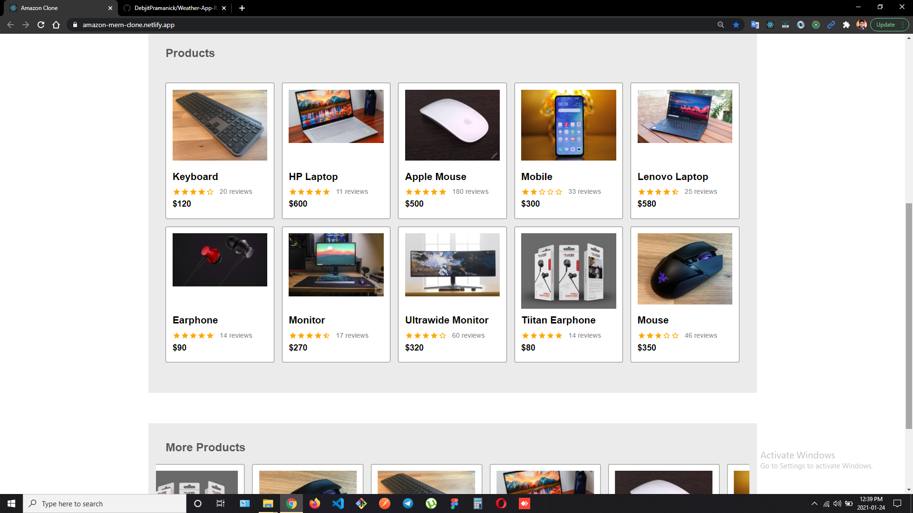

# AMAZON CLONE
Hello, i  am kunal singh and here is the list of functions provided by the app and the technologies used , 
thank you.

 
 
> ### Web App Link - https://amazon-mern-clone.netlify.app/

 

## Features

- Register or login as an user.
- Update user account.
- Search products.
- Apply filters for searching products.
- Add products to cart.
- Change the required number for products.
- Payment with PayPal.
- Create order.
- Check order history.

##  NPM Packages Used

- React-redux
- Material UI
- Express
- Nodemon
- Mongoose

## Screenshots

 

 

